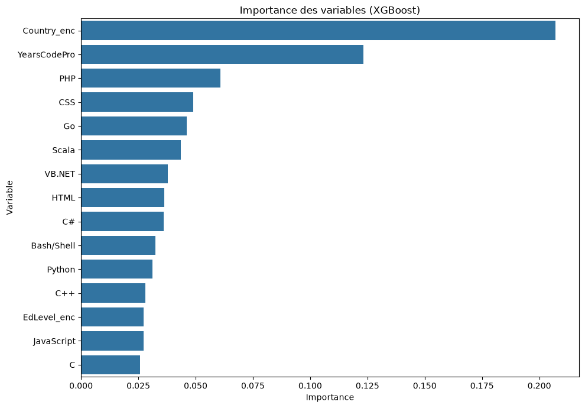

# Prédiction du salaire d’un développeur selon ses compétences

## 🇫🇷 Français

### Présentation

Ce projet étudie les facteurs associés au salaire annuel déclaré par des développeurs et transforme l’analyse en une application web. Il suit une démarche reproductible : exploration, nettoyage, analyse exploratoire, modélisation comparative, évaluation critique et mise à disposition d’une API et d’une interface React.

Le rapport détaillé est disponible dans [rapport_final.md](./rapport_final.md).

### Contexte et problématique

Les salaires du secteur technologique varient selon l’expérience, le pays, le niveau d’études et les compétences techniques. Le projet examine la question suivante :

> Dans quelle mesure ces caractéristiques permettent-elles d’estimer le salaire annuel déclaré, et quel modèle obtient le meilleur compromis de performance sur les données étudiées ?

### Données

Les notebooks utilisent le [Stack Overflow Developer Survey 2018](https://survey.stackoverflow.co/2018#overview). Les variables principales sont l’expérience professionnelle (`YearsCodePro`), le pays (`Country`), le niveau d’études (`EdLevel`), les langages et technologies (`LanguageHaveWorkedWith`) et le salaire annuel converti en dollars US (`ConvertedCompYearly`).

Le nettoyage conserve les salaires entre 5 000 et 500 000 USD, les réponses à temps plein et les observations complètes pour les variables du modèle. Les données sont déclaratives et issues d’une enquête en ligne ; elles ne représentent pas l’ensemble du marché mondial.

Le CSV brut n’est pas inclus dans le dépôt : il pèse environ 187 Mio, au-delà de la limite GitHub de 100 Mo par fichier. Le jeu nettoyé utilisé par l’application est inclus dans `data/processed/`. Pour réexécuter les notebooks, téléchargez le CSV public de 2018 et placez-le sous `data/raw/survey_results_public.csv`.

### Méthodologie

1. Exploration des colonnes, distributions et valeurs manquantes.
2. Harmonisation et nettoyage des variables dans le notebook 02.
3. Analyse exploratoire des salaires, de l’expérience, des pays et des compétences.
4. Encodage multi-label des langages et encodage des variables catégorielles.
5. Comparaison d’une Régression Linéaire, d’un Random Forest, d’XGBoost et d’un réseau de neurones TensorFlow/Keras.
6. Évaluation par MAE, RMSE et R² sur une partition aléatoire fixe 80/20.
7. Sauvegarde du modèle XGBoost, des encodeurs, des métriques et des importances.
8. Exposition de la prédiction via Flask et affichage des résultats dans React/Recharts.

Le split aléatoire mesure la performance sur cette partition, pas la capacité à prévoir l’évolution future des salaires. Le réseau TensorFlow n’a pas de graine explicite pour son initialisation ; son score peut donc varier légèrement lors d’un nouvel entraînement.

### Résultats enregistrés

Les chiffres ci-dessous proviennent de `models/metriques.json` et sont exprimés sur la partition de test du notebook 04.

| Modèle | MAE (USD) | RMSE (USD) | R² |
|---|---:|---:|---:|
| Régression Linéaire | 30 434 | 49 911 | 0,221 |
| Random Forest | 25 513 | 48 567 | 0,262 |
| XGBoost | **22 649** | **45 163** | **0,362** |
| TensorFlow (réseau de neurones) | 27 844 | 49 338 | 0,238 |

XGBoost obtient les plus faibles erreurs et le R² le plus élevé parmi ces résultats enregistrés. Cela ne signifie pas que le modèle est exact pour chaque profil : son erreur reste importante, et les scores dépendent de l’échantillon, du filtrage et de la partition choisis.

### Visualisations




### Application

L’interface comprend quatre vues :

- **Prédiction** : saisie du profil, estimation en USD, export PDF et historique temporaire de session.
- **Comparateur** : comparaison du même profil entre plusieurs pays.
- **Tableau de bord** : métriques des quatre modèles, importance des variables XGBoost et salaires médians observés par langage.
- **À propos** : contexte, méthodologie, choix technologiques et limites.

Les pays, études et langages proposés proviennent des modalités apprises par le modèle. Les modalités inconnues sont refusées par l’API au lieu d’être silencieusement converties en une catégorie arbitraire.

### Démonstration


*L’enregistrement, réalisé en local, montre la saisie d’un profil, le résultat estimé et un aperçu du tableau de bord. Le lien de démonstration en ligne sera ajouté ici après le déploiement des deux services Render (voir la section Déploiement ci-dessous).*

### Structure du projet

```text
.
├── app/
│   └── app.py                         # API REST Flask
├── data/
│   ├── raw/                           # enquête source Stack Overflow
│   └── processed/                     # jeu nettoyé utilisé par le modèle
├── frontend/
│   ├── src/
│   │   ├── pages/                     # prédiction, comparateur, dashboard, à propos
│   │   ├── App.jsx
│   │   └── api.js
│   ├── package.json
│   └── index.html
├── models/                            # modèle XGBoost et artefacts de prédiction
├── notebooks/
│   ├── 01_exploration.ipynb
│   ├── 02_nettoyage.ipynb
│   ├── 03_analyse_visualisation.ipynb
│   └── 04_modelisation.ipynb
├── outputs/
│   ├── demo/demo-projet2.gif          # démonstration animée optimisée
│   └── figures/                       # visualisations exportées
├── src/                               # fonctions Python réutilisables
├── rapport_final.md
├── requirements.txt
├── requirements-api.txt
└── validate_project.py
```

### Installation et validation

Prérequis : Python 3.11 ou plus récent, Node.js LTS et npm. L’API de production n’installe que ses dépendances nécessaires ; `requirements.txt` contient aussi les bibliothèques d’analyse et TensorFlow utilisées par les notebooks.

```powershell
python -m venv .venv
.\.venv\Scripts\Activate.ps1
python -m pip install -r requirements.txt
python validate_project.py

cd frontend
npm.cmd install
npm.cmd run lint
npm.cmd run build
```

Pour rejouer les notebooks de bout en bout (opération plus longue, qui régénère les fichiers traités et les artefacts du modèle), téléchargez d’abord le CSV brut comme indiqué dans la section Données :

```powershell
cd ..
python validate_project.py --execute-notebooks
```

### Lancer l’application en local

Dans un premier terminal, à la racine :

```powershell
python app/app.py
```

Dans un deuxième terminal :

```powershell
cd frontend
npm.cmd run dev
```

Ouvrir l’adresse Vite affichée, généralement `http://localhost:5173`. L’interface appelle par défaut l’API à `http://127.0.0.1:5000`. Pour une autre adresse, définir `VITE_API_URL` avant de lancer ou construire le frontend.

L’API propose `GET /`, `GET /api/languages`, `GET /api/options`, `GET /api/metrics` et `POST /api/predict`.

### Déploiement Render

Le déploiement public n’est pas encore configuré. Après la publication du dépôt, créez deux services Render reliés à ce même dépôt. Pour l’API (**New → Web Service**), utilisez :

- **Build command** : `pip install -r requirements-api.txt`
- **Start command** : `gunicorn app.app:app`
- **Root directory** : racine du dépôt

Pour React (**New → Static Site**), utilisez le répertoire racine `frontend`, la commande de build `npm run build` et le répertoire publié `dist`. Définissez `VITE_API_URL` avec l’URL publique de l’API avant le build. Après la publication GitHub, `VITE_REPOSITORY_URL` peut aussi être définie pour afficher les liens du dépôt et du rapport dans la page À propos.

Les URLs publiques seront ajoutées après le déploiement et un test complet des deux services. Sur l’offre gratuite de Render, une API inactive peut s’endormir et son premier réveil peut ralentir la première requête.

### Technologies et compétences

| Technologie | Utilisation dans le projet |
|---|---|
| Pandas, NumPy | Préparation des données et calcul |
| Matplotlib, Seaborn | Analyse exploratoire et graphiques de notebooks |
| Scikit-learn | Prétraitement, modèles de référence et métriques |
| XGBoost | Modèle principal de prédiction |
| TensorFlow/Keras | Comparaison expérimentale |
| Flask, Flask-CORS | API REST et échanges cross-origin |
| React, Vite, Recharts, jsPDF | Interface, graphiques et export PDF |
| Render | Cible de déploiement envisagée |

### Limites et usage responsable

- Les réponses sont auto-déclarées et sujettes à un biais de sélection.
- Le salaire est associé au pays et aux compétences dans l’échantillon, mais ces associations ne démontrent pas de causalité.
- Le modèle peut reproduire les écarts et biais présents dans les données d’enquête.
- Une MAE d’environ 22 649 USD reste élevée pour une décision individuelle.
- Les résultats ne sont ni une référence normative, ni un conseil de négociation ou de rémunération.
- La sélection des langages fréquents et l’encodage des catégories sont préparés avant le split train/test dans le notebook actuel ; les performances peuvent donc bénéficier d’une fuite d’information sur la distribution des entrées.
- La graine de TensorFlow n’est pas fixée ; les métriques du réseau de neurones peuvent varier légèrement entre deux exécutions.
- Une validation sur des enquêtes récentes, une validation temporelle et une analyse des biais par sous-groupe sont des pistes nécessaires.

### Auteure

**Kawtar Boughal** — [LinkedIn](https://www.linkedin.com/in/kawtar-boughal02)

---

## 🇬🇧 English

### Overview

This project studies factors associated with developers’ self-reported annual salaries and turns the analysis into a web application. It follows a reproducible workflow: exploration, data cleaning, exploratory analysis, model comparison, critical evaluation, and delivery through a REST API and a React interface.

Read the detailed report in [rapport_final.md](./rapport_final.md).

### Context and research question

Technology salaries vary with experience, country, education and technical skills. This project asks how well these characteristics estimate reported annual salary and which model performs best on the selected data.

### Data and methodology

The notebooks use the Stack Overflow Developer Survey 2018. The target is annual compensation converted to USD. The cleaning step retains salaries between USD 5,000 and USD 500,000, full-time responses, and complete records for model inputs.

The 2018 raw CSV (about 187 MiB) is not committed because GitHub rejects files larger than 100 MB. The processed dataset used by the application is included. To rerun the notebooks, download the public 2018 survey file and place it at `data/raw/survey_results_public.csv`.

The workflow compares Linear Regression, Random Forest, XGBoost and a TensorFlow/Keras neural network using MAE, RMSE and R². A fixed random 80/20 split is used; it is not a temporal validation and does not establish future performance.

### Recorded results

| Model | MAE (USD) | RMSE (USD) | R² |
|---|---:|---:|---:|
| Linear Regression | 30,434 | 49,911 | 0.221 |
| Random Forest | 25,513 | 48,567 | 0.262 |
| XGBoost | **22,649** | **45,163** | **0.362** |
| TensorFlow neural network | 27,844 | 49,338 | 0.238 |

XGBoost has the lowest recorded errors and highest R² in the stored evaluation. Its error remains substantial, and these scores depend on the sampled respondents, filtering and chosen split.

### Application and setup

The React application provides salary prediction, country comparison, a model dashboard, and project documentation. The Flask API exposes `/`, `/api/languages`, `/api/options`, `/api/metrics` and `/api/predict`.

Watch the [short application demo](./outputs/demo/demo-projet2.gif), recorded locally and showing a profile, a salary prediction, and the model dashboard. The live demo link will be added here after both Render services are deployed.

Install the Python environment and validate the project:

```powershell
python -m venv .venv
.\.venv\Scripts\Activate.ps1
python -m pip install -r requirements.txt
python validate_project.py
cd frontend
npm.cmd install
npm.cmd run lint
npm.cmd run build
```

Run the backend from the repository root with `python app/app.py`, then run `npm.cmd run dev` from `frontend` in PowerShell. The application defaults to `http://127.0.0.1:5000` for the API and Vite usually serves the frontend at `http://localhost:5173`.

### Responsible use and limitations

The survey is self-reported and not representative of all developers or countries. The model may reproduce existing disparities and does not establish causal effects. Its predictions are exploratory estimates, not normative salary recommendations or individual compensation advice. Temporal validation, newer data and subgroup bias analysis are important next steps.

No public deployment URL is claimed yet. The API and frontend URLs should be added here after deploying both Render services and testing the complete application.
