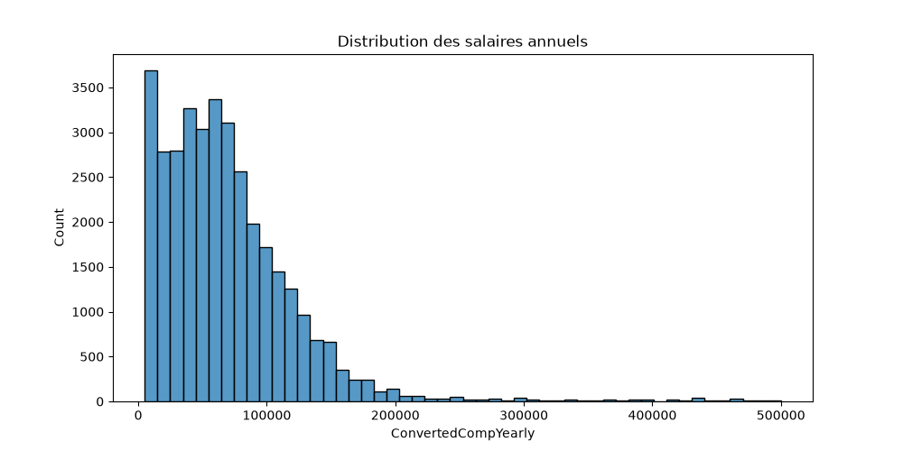
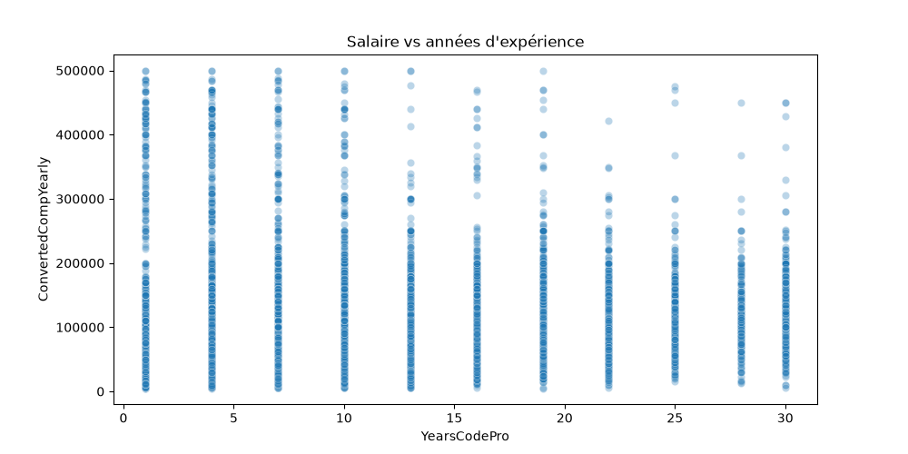
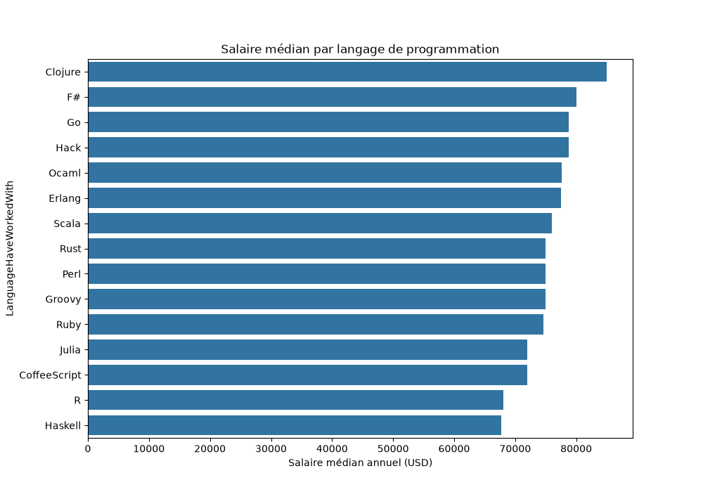
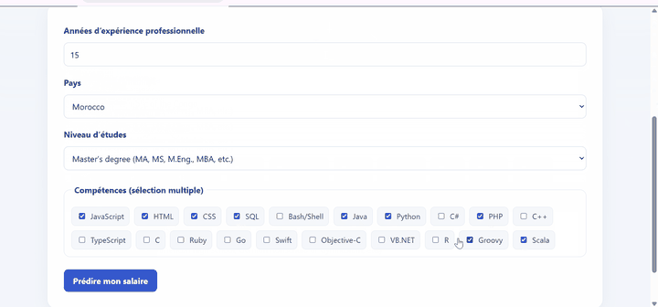

# Rapport final — Prédiction du salaire d’un développeur selon ses compétences

## 1. Résumé exécutif

Ce projet explore la relation entre les caractéristiques professionnelles déclarées par des développeurs et leur salaire annuel converti en dollars US. À partir du Stack Overflow Developer Survey 2018, le travail couvre le chargement, le nettoyage, l’analyse exploratoire, la préparation de variables, la comparaison de quatre modèles et la mise en place d’une application web.

Les modèles évalués sont une Régression Linéaire, un Random Forest, XGBoost et un réseau de neurones TensorFlow/Keras. Dans les métriques sauvegardées, XGBoost obtient le meilleur résultat parmi les quatre modèles comparés : MAE de 22 649 USD, RMSE de 45 163 USD et R² de 0,362. Ces scores sont utiles pour comparer les modèles sur la partition choisie, mais l’erreur absolue reste élevée et ne rend pas les prédictions individuelles fiables pour fixer une rémunération.

Le projet fournit également une API REST Flask et une interface React pour tester une estimation, comparer plusieurs pays et consulter les résultats. Le déploiement public reste à configurer ; aucun lien de démonstration en ligne n’est revendiqué.

## 2. Contexte, objectif et problématique

Les rémunérations du secteur technologique présentent des différences importantes selon l’expérience, la localisation, le niveau d’études et les compétences déclarées. Les enquêtes publiques permettent d’étudier ces facteurs, mais leurs données restent à préparer et leurs résultats doivent être interprétés avec prudence.

**Objectif :** construire une chaîne de traitement reproductible et une application de démonstration capables d’estimer un salaire annuel à partir du profil fourni par l’utilisateur.

**Problématique :** dans quelle mesure l’expérience professionnelle, le pays, le niveau d’études et les compétences techniques permettent-ils d’estimer le salaire annuel déclaré, et quel modèle offre les meilleures performances sur le jeu étudié ?

## 3. Données et variables

La source est le [Stack Overflow Developer Survey 2018](https://survey.stackoverflow.co/2018#overview), un questionnaire volontaire en ligne. Les champs utilisés sont :

| Variable | Description |
|---|---|
| `YearsCodePro` | Nombre d’années d’expérience professionnelle en programmation |
| `Country` | Pays déclaré par le répondant |
| `EdLevel` | Niveau d’études déclaré |
| `LanguageHaveWorkedWith` | Langages et technologies utilisés, séparés par des points-virgules |
| `Employment` | Situation d’emploi |
| `ConvertedCompYearly` | Rémunération annuelle convertie en dollars US |

La cible est `ConvertedCompYearly`. La conversion en USD facilite l’affichage et la comparaison dans l’application, mais ne corrige pas à elle seule les différences de coût de la vie, de fiscalité ou de pouvoir d’achat entre pays.

Les répondants constituent un échantillon d’enquête et non une base exhaustive de travailleurs. Les salaires sont auto-déclarés et certaines populations sont probablement surreprésentées. Le jeu ne doit donc pas être interprété comme une mesure représentative du marché global.

Le CSV brut pèse environ 187 Mio et n’est pas versionné dans GitHub, dont la limite par fichier est de 100 Mo. Le jeu nettoyé nécessaire à l’application est fourni dans `data/processed/`. Pour rejouer le nettoyage et les notebooks, il faut télécharger le fichier public de 2018 et le placer dans `data/raw/survey_results_public.csv`.

## 4. Méthodologie

### 4.1 Notebook 01 — Exploration

Le notebook `01_exploration.ipynb` inspecte les colonnes de l’enquête, prépare une vue réduite des variables pertinentes et examine les valeurs manquantes et les statistiques du salaire.

### 4.2 Notebook 02 — Nettoyage

Le notebook `02_nettoyage.ipynb` :

1. harmonise les noms de colonnes de l’enquête 2018 avec les noms utilisés dans le pipeline ;
2. conserve les variables nécessaires à l’analyse ;
3. supprime les lignes sans salaire annuel ;
4. conserve les salaires compris entre 5 000 et 500 000 USD ;
5. convertit les valeurs textuelles particulières d’expérience en années numériques ;
6. conserve les répondants employés à temps plein ;
7. retire les lignes sans pays, niveau d’études ou compétences renseignés ;
8. écrit `data/processed/donnees_salaires_developpeurs.csv`.

Les bornes de salaire réduisent l’influence de valeurs extrêmes ou d’erreurs possibles, mais elles écartent aussi des salaires réels hors de cet intervalle. Les résultats dépendent de ce choix de filtrage.

### 4.3 Notebook 03 — Analyse exploratoire

Le notebook `03_analyse_visualisation.ipynb` examine les distributions et crée notamment :

- la distribution des salaires annuels ;
- le salaire selon l’expérience professionnelle ;
- le salaire médian par langage, sous réserve d’un nombre minimal de réponses ;
- les salaires par pays et niveau d’études.

Les figures exportées sont dans `outputs/figures/`. Les différences observées sont descriptives ; elles ne démontrent pas qu’une compétence cause une hausse de salaire.



*Figure 1 — Distribution des salaires annuels conservés après nettoyage.*



*Figure 2 — Relation descriptive entre expérience professionnelle et salaire annuel.*



*Figure 3 — Salaire médian observé selon les langages déclarés.*

### 4.4 Notebook 04 — Préparation et modélisation

Les langages déclarés sont séparés en listes puis encodés en colonnes binaires. Le modèle conserve les 20 langages les plus fréquemment déclarés. Une variable supplémentaire, `nb_competences`, représente le nombre de langages sélectionnés.

Le pays et le niveau d’études sont transformés par `LabelEncoder`. Ce choix est simple mais attribue un nombre à chaque catégorie sans signification ordinale intrinsèque ; un encodage one-hot ou un pipeline de prétraitement ajusté uniquement sur les données d’entraînement pourrait être plus approprié.

Les données sont partagées en un ensemble d’entraînement de 80 % et un ensemble de test de 20 %, avec une graine aléatoire fixe pour le partage (`random_state=42`). Ce protocole stabilise la partition, mais le réseau TensorFlow ne fixe pas explicitement sa graine d’initialisation : son score peut varier légèrement d’une exécution à l’autre. Il ne s’agit pas d’une validation temporelle.

**Point méthodologique à corriger dans une prochaine itération :** le notebook choisit les 20 langages les plus fréquents et ajuste les encodeurs de catégories avant le partage entraînement/test. Ces opérations utilisent donc la distribution des entrées du jeu de test. Elles ne consultent pas directement les salaires de test, mais constituent une fuite d’information de prétraitement et peuvent rendre les scores trop optimistes. Une version plus rigoureuse doit séparer d’abord les observations, ajuster un `Pipeline`/`ColumnTransformer` uniquement sur l’entraînement et transformer ensuite le test. Les métriques ci-dessous doivent être lues avec cette réserve.

Les modèles comparés sont :

- **Régression Linéaire** : référence interprétable ;
- **Random Forest Regressor** : ensemble d’arbres, 200 estimateurs ;
- **XGBoost Regressor** : gradient boosting pour données tabulaires, 300 estimateurs, taux d’apprentissage 0,05 et profondeur maximale 6 ;
- **TensorFlow/Keras** : réseau dense à deux couches cachées (64 puis 32 neurones), entraîné sur les variables standardisées pour une comparaison expérimentale.

## 5. Métriques et résultats enregistrés

Les résultats proviennent de `models/metriques.json`. L’erreur est présentée en USD par année de salaire.

| Modèle | MAE (USD) | RMSE (USD) | R² |
|---|---:|---:|---:|
| Régression Linéaire | 30 433,78 | 49 910,71 | 0,221 |
| Random Forest | 25 512,53 | 48 566,54 | 0,262 |
| XGBoost | **22 649,33** | **45 162,79** | **0,362** |
| TensorFlow (NN) | 27 844,05 | 49 337,72 | 0,238 |

- **MAE** : moyenne des valeurs absolues des erreurs ; elle donne une erreur typique dans l’unité de la cible.
- **RMSE** : pénalise davantage les erreurs élevées.
- **R²** : compare la qualité d’ajustement à une prédiction basée sur la moyenne de la cible ; il ne mesure pas l’exactitude individuelle.

XGBoost gagne sur les trois valeurs enregistrées pour cette partition. Le réseau de neurones n’améliore pas les scores de XGBoost dans cette expérience. Ce constat est cohérent avec l’intérêt d’évaluer plusieurs familles de modèles plutôt que de supposer qu’un modèle plus complexe sera meilleur.

Une MAE supérieure à 22 000 USD demeure importante. Une estimation peut donc être très éloignée du salaire observé, notamment pour des profils ou pays peu représentés. Les métriques ne doivent pas être présentées comme une garantie de précision universelle.

## 6. Application web et architecture

```text
Stack Overflow Developer Survey 2018
        │
        ├── notebooks 01–03 : exploration, nettoyage et analyse
        └── notebook 04 : encodage, entraînement, évaluation et sauvegarde
                    │
          modèle XGBoost + encodeurs + métriques
                    │
         Flask / Flask-CORS — API REST JSON
                    │
         React / Vite — Recharts — jsPDF
```

L’API (`app/app.py`) charge les artefacts depuis `models/` en utilisant des chemins relatifs au projet et expose :

| Route | Fonction |
|---|---|
| `GET /` | Vérification de disponibilité de l’API |
| `GET /api/languages` | Langages disponibles pour la sélection |
| `GET /api/options` | Pays, niveaux d’études et langages appris |
| `POST /api/predict` | Estimation pour un profil JSON |
| `GET /api/metrics` | Scores des modèles, importances et résumé par langage |

Les requêtes de prédiction doivent fournir `years`, `country`, `edlevel` et `langages`. Les valeurs catégorielles sont contrôlées par rapport aux catégories connues. Une catégorie inconnue ou un contenu invalide donne une réponse HTTP 400 explicite plutôt qu’un encodage silencieux.

L’interface React comprend :

1. **Prédiction** : formulaire de profil, estimation, export PDF et historique temporaire de la session ;
2. **Comparateur** : estimations du même profil pour les pays sélectionnés ;
3. **Tableau de bord** : MAE/RMSE, tableau incluant R², importance des variables et salaire médian descriptif par langage ;
4. **À propos** : contexte, méthode, justification des technologies et limites.

L’historique n’est pas persistant : aucun compte ni base de données n’est implémenté. Le PDF est généré dans le navigateur.

La capture animée ci-dessous illustre un parcours type : saisie d’un profil dans la page Prédiction, estimation obtenue, puis aperçu du Tableau de bord.



*Démonstration réalisée en local. Le lien de démonstration en ligne sera ajouté après le déploiement des services (voir section 9).*


## 7. Technologies

| Technologie | Rôle |
|---|---|
| Python, Pandas, NumPy | Chargement, nettoyage et manipulation des données |
| Matplotlib, Seaborn | Visualisations exploratoires |
| Scikit-learn | Prétraitement, modèles de référence et métriques |
| XGBoost | Modèle retenu pour l’API |
| TensorFlow/Keras | Modèle expérimental comparatif |
| Flask, Flask-CORS | API REST |
| React, Vite | Application frontend |
| Recharts | Graphiques interactifs |
| jsPDF | Export PDF côté navigateur |
| Render | Cible de déploiement prévue, non publiée à la rédaction de ce rapport |

## 8. Limites et considérations éthiques

1. **Biais de sélection :** les répondants volontaires de Stack Overflow ne reflètent pas nécessairement tous les profils professionnels.
2. **Biais sociaux et géographiques :** le modèle peut reproduire les écarts présents dans les réponses, y compris ceux liés indirectement à des facteurs non observés.
3. **Auto-déclaration :** les salaires et compétences ne sont pas vérifiés par une source administrative.
4. **Encodage catégoriel :** `LabelEncoder` donne un ordre numérique arbitraire aux pays et niveaux d’études.
5. **Fuite de prétraitement :** la sélection des langages et l’encodage utilisent actuellement toutes les observations avant le split ; les transformations doivent être ajustées uniquement sur l’entraînement.
6. **Découpage aléatoire :** les scores n’évaluent pas la généralisation à une année ultérieure ou à un choc du marché.
7. **Couverture :** les modalités rares et les catégories absentes de l’apprentissage ne peuvent être évaluées correctement.
8. **Reproductibilité partielle :** la graine TensorFlow n’est pas définie ; les résultats du réseau de neurones peuvent varier légèrement.
9. **Usage :** les estimations sont exploratoires. Elles ne sont pas une référence normative, un conseil de rémunération ni un substitut à une analyse du marché local.

Avant un usage décisionnel, il faudrait disposer de données récentes et plus représentatives, définir une validation temporelle, étudier les erreurs par pays et sous-groupes, documenter les intervalles d’incertitude et solliciter une revue humaine.

## 9. Reproductibilité et exécution

Installer les dépendances analytiques :

```powershell
python -m venv .venv
.\.venv\Scripts\Activate.ps1
python -m pip install -r requirements.txt
```

Vérifier la structure, les notebooks, les artefacts et les routes de l’API :

```powershell
python validate_project.py
```

Pour exécuter tous les notebooks dans l’ordre et régénérer leurs sorties :

```powershell
python validate_project.py --execute-notebooks
```

Lancer ensuite les deux services en local, dans deux terminaux :

```powershell
# Terminal 1, depuis la racine
python app/app.py
```

```powershell
# Terminal 2
cd frontend
npm.cmd install
npm.cmd run dev
```

L’API locale est `http://127.0.0.1:5000`, et Vite affiche normalement `http://localhost:5173`.

Pour un déploiement Render, le service API utilise `pip install -r requirements-api.txt` et `gunicorn app.app:app`. Le site React se construit avec `npm run build` depuis `frontend` et publie `dist`. Le déploiement public n’est pas encore effectué ; les liens ne seront ajoutés qu’après le déploiement et le test des services.

## 10. Conclusion et perspectives

Le projet démontre une chaîne de traitement allant des données d’enquête à une interface de prédiction, tout en comparant quatre approches. Sur l’évaluation sauvegardée, XGBoost est le meilleur des modèles testés, sans pour autant produire une précision suffisante pour une décision individuelle.

Les suites prioritaires sont l’encodage catégoriel sans ordre artificiel, une validation croisée ou temporelle selon la question étudiée, une analyse des erreurs et biais par sous-groupe, une estimation d’incertitude, l’actualisation des données et la publication vérifiée de l’application.

## English summary

This project analyzes self-reported developer salaries from the Stack Overflow Developer Survey 2018 and delivers a Flask REST API with a React application. It compares Linear Regression, Random Forest, XGBoost and a TensorFlow/Keras neural network using MAE, RMSE and R² on a fixed random 80/20 split.

The stored results favor XGBoost (MAE USD 22,649; RMSE USD 45,163; R² 0.362); the TensorFlow run recorded MAE USD 27,844, RMSE USD 49,338 and R² 0.238. The remaining error is substantial and the evaluation does not establish future performance. Survey selection bias, self-reported values, arbitrary ordinal encoding and potential geographic or social bias limit the conclusions. Predictions are exploratory and must not be treated as normative salary recommendations.
